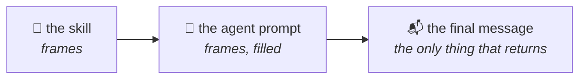

<div align="center">



*A sub-agent wakes as a stranger holding one page. Everything it needs is on that page or it does not exist.*

[](LICENSE.md)
[](https://code.claude.com/docs/en/sub-agents)


</div>

> [!IMPORTANT]
> **This repository has moved into [OpenCnid/dovetail](https://github.com/OpenCnid/dovetail).**
>
> `subagent-composition` is now one of nine skills in that pack, at
> [`skills/subagent-composition/`](https://github.com/OpenCnid/dovetail/tree/main/skills/subagent-composition).
> Install the whole pack with a plain clone — there are no submodules:
>
> ```bash
> git clone https://github.com/OpenCnid/dovetail.git
> cd dovetail && bash scripts/install.sh
> ```
>
> The eight skills were separate repositories while each was developed on its
> own. They are used together, so they are now maintained together; keeping them
> apart cost a pin-bumping step before every change and bought nothing a reader
> could see. This repository is archived and read-only. Its history is the record
> of how this skill got here, and `docs/provenance.md` in dovetail names the
> commit its content arrived at.


> **A composition skill, not a collection of agents.** This repo ships one
> Claude Code skill that writes sub-agents on the fly — persona, context
> transfer, tool budget, return contract — plus the live probe findings that
> corrected it twice. It contains no ready-made agents to install, because the
> useful artifact was never a library of agents. It was the method for
> producing the right one in the moment.

> [!IMPORTANT]
> **The boundary is the whole subject.** A sub-agent does not inherit your
> conversation, your system prompt, your auto-memory, or the skills you have
> loaded. Only its **final message** comes back; every intermediate tool result
> is discarded unread. Almost every disappointing sub-agent is a transfer
> failure — something you knew and never handed over — not a model failure.

## The ledger that runs everything

| Crosses the boundary | Does **not** cross |
|---|---|
| The agent's own prompt (file body, or the `prompt` param) | Your conversation history and every tool result in it |
| The whole `CLAUDE.md` hierarchy — user, project, rules, managed policy | Your system prompt and harness instructions |
| Tool *definitions* for its allowlist | **Auto-memory** — including anything you just "remembered" |
| Skills named in `skills:` (full body) | Skills *you* have loaded |
| Names of sibling agents | Your reasoning, dead ends, and the user's actual intent |

Explore and Plan are the one exception, and it is per-agent rather than
per-setting: they alone skip `CLAUDE.md`, and no frontmatter field changes that.

Two consequences do all the work. Anything unstated is absent, so the prompt is
a **transfer manifest**, not a reminder. And the deliverable is one message, so
you **design the return first and write the task backwards from it**.

## Frames all the way down

The skill emits a prompt, and that prompt shapes a further generation. Writing
prose *about* a desired format is a weak prior; a frame is a strong one. So the
instruction load lives in frames and variable names at every level:



Level 3 is the one everybody misses. `## Return` should **contain a literal
frame**, not a paragraph describing one — shape without content is precisely
what a [hypershot](#-standing-on-the-shoulders-of-giants) is for, and it is the
one slot where a weak prior is unrecoverable, because there is no second
message in which to correct it.

## The disproving arm

Siblings primed to find a problem find it, and each one honestly. Their returns
then agree — and **agreement among arms that share a prior is not corroboration.
It is the prior, restated N times.** Nothing in a fan-out can catch that from
inside, because no sibling is looking.

So when a fan-out's finding would change *what kind of work follows* — rebuild
versus repair, absent versus unreachable, defect versus default — one additional
arm is spawned whose only job is to disprove the reading the others are
converging on, and whose ground block says so in those words.

The trigger is narrow on purpose. Routine sweeps do not get one; this is a
single agent on scope-changing findings, not a standing skeptic on every
dispatch.

> **Provenance.** Three sweeps primed on "the build drifted toward retrieval"
> found drift, correctly and everywhere they looked. A fourth, primed to bound
> the claim, found the capability the other three had reported missing — built,
> and merely unreachable. Without it the session would have carried a rebuild
> estimate for work already done.

## 🛠️ Using it

Clone and copy the skill into Claude Code — still one directory, and the
`mkdir` is not optional:

```bash
git clone https://github.com/OpenCnid/subagent-composition.git
mkdir -p ~/.claude/skills
cp -r subagent-composition/skills/subagent-composition ~/.claude/skills/
```

PowerShell:

```powershell
git clone https://github.com/OpenCnid/subagent-composition.git
New-Item -ItemType Directory -Force -Path ~/.claude/skills
Copy-Item -Recurse -Force subagent-composition/skills/subagent-composition ~/.claude/skills/
```

> [!WARNING]
> **Do not drop the `mkdir` as noise — it is the whole install.** If `~/.claude`
> exists but `~/.claude/skills/` does not, which is the state of anyone who has
> never installed a skill, `cp` reads the trailing path as a *rename target*:
> you get `~/.claude/skills/SKILL.md` and no skill directory at all. Exit code
> 0, no output, no error, and a skill that never loads. `-Force` on `Copy-Item`
> is load-bearing the same way — without it the second run, the upgrade path,
> fails outright with "an item with the specified name already exists."

If `CLAUDE_CONFIG_DIR` is set it replaces `~/.claude`, so install into
`$CLAUDE_CONFIG_DIR/skills` instead.

Two caveats, both of which fail quietly if you miss them:

- **The destination really is `~/.claude/skills/`.** The skill body works from
  anywhere, but the bundled hook only loads from a user-level skills root. Copy
  the same directory into a project's `.claude/skills/` and you get a skill whose
  hooks fire zero times and say so zero times.
- **It arrives next session.** Nothing to install, nothing to reload — but a
  session that was already open when you copied will not see it.

Then say *"spawn an agent that…"*, *"build me a sub-agent for…"*, or
*"this agent came back with garbage"* and it triggers on its own. It also fires
on the question most worth asking first — **whether to delegate at all** — which
it answers "no" more often than you might like.

> [!NOTE]
> **The companions are named here, not shipped here.** `prompt-engineering` and
> `hypershot-protocol` live elsewhere. Composing an agent prompt *is* authoring
> prompt bytes, and those two are what OpenCnid loads first when that happens —
> so the skill stopped merely recommending them. A bundled `UserPromptExpansion`
> hook fires on `/subagent-composition` and injects one line telling the model to
> load both with the `Skill` tool. A directive rather than the bodies, because
> hook output is capped at 10,000 characters and `hypershot-protocol` is 10,312
> on its own. If a companion is absent the directive says to note it once and
> continue, so **the skill still works without them** — which is the entire
> reason it asks the model to load them rather than depending on them.
> Preloading through a sub-agent's `skills:` is the one path no hook can reach;
> list all three names there yourself. (The skill also links `judge-composition`
> with a `[[wikilink]]`. That one is a signpost, and nothing loads it.)

## What the probe found

The docs describe most of this. Some of it they don't, and one behavior
actively lies to you. Full write-up in **[docs/FINDINGS.md](docs/FINDINGS.md)**;
the short version:

| behavior | status |
|---|---|
| `skills:` accepts scalar, `[flow]`, **and** block-sequence YAML — all equivalent | ✅ verified |
| `skills:` loads the **full skill body**, not just the name | ✅ verified |
| `tools:` is comma-separated (`Read, Grep`) and **replaces** inheritance rather than trimming it | ✅ verified |
| `--agent {name}` **silently ignores `skills:`** — session mode and spawn are different paths | ⚠️ trap |
| Agent registration **lags the filesystem in both directions** | ⚠️ trap |
| The ephemeral `Agent` call **cannot express `maxTurns`, `effort`, `tools`, or `skills`** — those four need a definition file | ⚠️ observed, not harnessed |
| Dropping a plugin manifest into a skill directory **does not rename the skill** — slash form, `Skill` tool param, and hook payload all keep the bare name | ✅ verified |
| That manifest is **inert under a project `.claude/skills/`** — zero hooks fired, zero warnings; only a user-level skills root loads it | ⚠️ trap |
| Hook output over **10,000 characters is silently replaced by a file path** | ⚠️ trap |

That fourth row is the expensive one. It makes a perfectly valid agent look
completely broken, and it is why this repo exists as documentation and not just
as a skill file.

## 🔬 Re-verify it yourself

Undocumented behavior has a shelf life. The probe harness is checked in, so you
can re-run it against whatever version you're on instead of trusting a table
written in July 2026:

```bash
bash probes/run-probes.sh
```

It plants canary tokens in a skill body and a `CLAUDE.md`, spawns five agents
that differ by one field each, prints a result matrix, and cleans up after
itself. Method and design rationale: **[docs/PROBE-METHODOLOGY.md](docs/PROBE-METHODOLOGY.md)**.

## 🏔️ Standing on the shoulders of giants

The composition discipline here is not ours. It is the **Lexideck prompt
engineering curriculum** by **[Matthew Murphy](https://github.com/gusthemole)** —
specifically the structural-clarity toolkit (semantic tagging, hierarchical
markers, structured placeholders, collections, attention management) and the
**hypershot**: the technique of priming structure without priming content, using
frames with free variables instead of contaminating few-shot examples. Every
frame in this repo is a hypershot, and the idea that a variable name can carry
its own generation rule is his, not ours.

We applied that toolkit to one specific boundary and probed what happens there.
That is a much smaller job than inventing the toolkit. Credit accordingly.

The mechanics are documented by Anthropic in the
[Claude Code sub-agent docs](https://code.claude.com/docs/en/sub-agents); where
this repo disagrees with them, **the docs win and this repo gets fixed** —
except where a probe result is reproducible, in which case we show our work and
say so out loud.

## Honest notes

- **Every claim here is version-pinned.** Probed on Claude Code **2.1.214**,
  July 2026. Undocumented behavior is undocumented precisely because nobody
  promised it would stay put. Re-run the harness before betting anything on it.
- **We shipped two wrong conclusions before the controls caught them.** First a
  hot-reload lag read as broken YAML; then `--agent` mode's silent `skills:`
  drop read as "the field doesn't work in filesystem frontmatter." Both were
  fully formed, confidently held, and wrong. The negative and positive controls
  are the only reason they didn't ship. That story is
  [the methodology doc](docs/PROBE-METHODOLOGY.md), and it is arguably more
  useful than the findings.
- **A skill that tells you not to use it is working.** The spawn gate rejects
  "the task is large" and "the user said thorough" as reasons to delegate. Cold
  starts re-derive context you already hold. Most tasks should stay inline.
- **This is not a benchmark.** Nobody has shown that a composed agent
  outperforms an ad-hoc prompt on real work. The mechanics are verified; the
  *value* of the composition discipline is argued, not measured. That test needs
  a real task and hasn't been run.
- **A human and an AI built this together.** The human said "let's do the live
  probe" at the exact moment the AI was about to publish a wrong answer. We
  disclose this because OpenCnid discloses this.

## Layout

```
skills/subagent-composition/            the skill — clone, copy, say "spawn an agent that…"
  ↳ .claude-plugin/plugin.json          makes the directory load as a plugin (user-level roots only)
  ↳ hooks/hooks.json                    the companion-skill directive, injected on invoke
.claude-plugin/plugin.json              root manifest — makes this repo installable as a plugin
docs/FINDINGS.md                        verified mechanics + the traps
docs/PROBE-METHODOLOGY.md               how to verify claims about agent internals
probes/agents/                          five diagnostic agents, one field different each
probes/run-probes.sh                    re-run the whole experiment on your version
AGENTS.md                               the agents' front door
assets/                                 banner art (the ✕ marks are load-bearing)
```

## What's next

- **The measurement that's missing.** Composed agent vs. ad-hoc prompt on a real
  task, scored. Until then the skill is a well-argued hypothesis.
- **More probes.** `isolation: worktree` cleanup semantics, `maxTurns` behavior
  at the ceiling, and whether `disallowedTools` really is applied before `tools`.
- **Version drift tracking.** Re-run the harness on each Claude Code minor and
  record what moved.

## License

Prose and skill: [CC BY 4.0](LICENSE.md) © OpenCnid Labs. The prompt-engineering
and hypershot techniques the skill applies are Matthew Murphy's work, credited
above — go read the source.

---

<div align="center">
<sub>No sub-agent was asked to guess what "the file we discussed" meant in the making of this repository.</sub>
</div>
